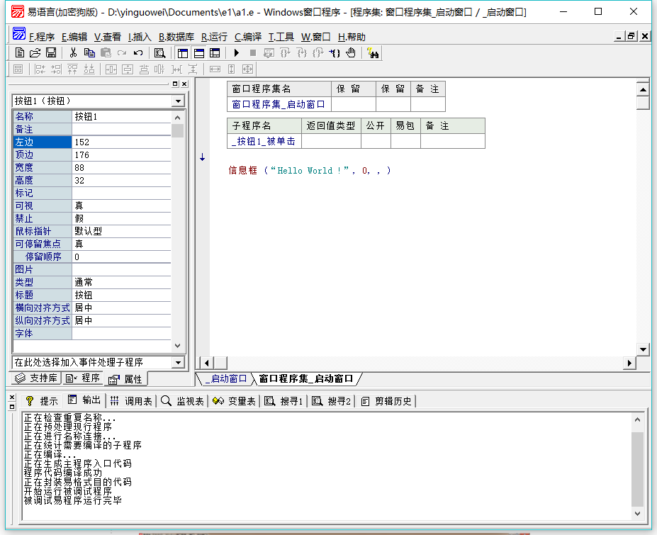
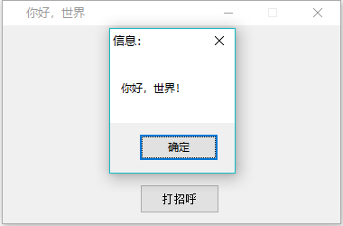

# Easy Programming Language

**Easy Programming Language** (**EPL**, [Chinese](https://en.wikipedia.org/wiki/Chinese_language): 易语言) is a Chinese [programming language](https://en.wikipedia.org/wiki/Programming_language), featuring a full Chinese environment. Its community may be the largest of all [non-English-based programming languages](https://en.wikipedia.org/wiki/Non-English-based_programming_languages). EPL is somewhat popular in China, considering the difficulties of adopting English for most Chinese speakers. 

## External links

- [EPL homepage](https://web.archive.org/web/20150916172034/http://epl.eyuyan.com/) at archive.org


## ScreenShots

- The form editor


- The source code editor

  

  The code text in file `你好世界.e` :

  ```
  .版本 2
  
  .程序集 窗口程序集_启动窗口
  
  .子程序 _打招呼_被单击
  
  
  信息框 (“你好，世界！”, 0, , )
  
  
  ```

  

- debugging

  